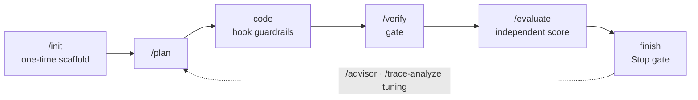

<div align="center">

# Harness Kit

**Project-agnostic *harness engineering* for [Claude Code](https://claude.com/claude-code)**

Weaves plan-gating, pre-completion verification, loop detection, and Generator / Evaluator separation directly into your AI coding workflow.

[](https://claude.com/claude-code)
[](./.claude-plugin/plugin.json)
[](https://github.com/whieet/harness-kit/actions/workflows/test.yml)
[](./LICENSE)

**English** · [简体中文](./README.md)

</div>

> The Simplified Chinese [README.md](./README.md) is the authoritative version; this English page mirrors it.

---

## What it is

Harness Kit is a **Claude Code plugin** (built for Claude Code — **not codex or other CLIs**). Using Claude Code's hooks / slash commands / subagents / skills, it adds automatic guardrails at the critical moments of AI coding: there must be a plan before you edit, the verification gate must pass before you finish, repeated edits to the same file raise a warning, and final quality is scored by an independent evaluator subagent.

Everything project-specific (verify commands, layering rules, plan directory, doc paths, metrics…) lives in each project's own `.harness/config.json` — the plugin code itself is **project-agnostic**, so the same harness applies to Godot, web, or any custom stack.

## What is harness engineering

A *harness* is **everything around the model** — system prompts, tools, context management, control flow, feedback loops, and memory. **Harness engineering** doesn't touch the model itself; it engineers this scaffolding around the model, molding spiky model intelligence into a reliable, long-running agent.

**Design philosophy** (distilled from public work by OpenAI / Anthropic / LangChain):

- **Leverage is in the harness, not the model** — you can't change the weights, but you can change the scaffolding; architecture choices matter as much as model choice.
- **Separate planning / generation / evaluation** — don't let one agent both do the work and grade itself; self-grading is unreliable, so use an independent evaluator with concrete, measurable criteria.
- **Self-verification loop** — explicit plan → build → test → fix forces the model to actually run tests and verify, instead of stopping at "looks right".
- **Incremental, not one-shot** — on long tasks agents tend to "do it all at once" and declare done prematurely; the harness enforces small steps and end-to-end verification.
- **Continuity across contexts** — context fills up / gets compacted and the agent "forgets"; progress files, memory, and clean handoffs (git commits, state snapshots) carry state across many context windows.
- **Detect bad patterns + budget reasoning** — loop detection and pre-completion checklists catch doom-loops; spend the high reasoning budget where it pays most: planning and verification.

> A harness's assumptions go stale as models improve — trim what newer models handle natively. Harness Kit turns this philosophy into ready-to-use, individually toggleable guardrails inside Claude Code (see [Core disciplines](#core-disciplines)).

## Why you need it

Harness Kit is built to stop the common ways AI coding goes off the rails:

- **Editing without a plan** — large changes lack a Definition of Done and drift.
- **Finishing without verifying** — declaring "done" without running lint / build / test.
- **Self-grading bias** — letting the generator score its own work is unreliable.
- **Lost context** — plans and progress vanish after a long session is compacted.
- **Doc / code drift** — docs slowly diverge from the implementation, links rot.

## Core disciplines

| Discipline | What it does |
| --- | --- |
| Plan-gating | A code edit needs a covering plan first; otherwise a plan skeleton is scaffolded for you |
| Verification gate | On Stop, runs the gates configured in `harness-verify`; in strict mode a failure blocks completion |
| Loop detection | Warns when a single file is edited past the threshold (default 5) in one session, preventing churn |
| Gen · Eval separation | Dispatches an edit-less `evaluator` subagent to score against the rubric — no self-grading |
| Context survival | Snapshots plans / progress before compaction and re-injects after, so long sessions keep state |
| Layering | Checks illegal cross-layer references against configurable dependency-direction rules |
| Doc coherence | Validates plan status, naming, placeholder content, dead links, and architecture drift |
| Effort routing | Low/medium-effort turns run only `fast`-tier gates (optional, off by default — never silently weakens verification) |
| Capability toggles | Every harness behavior can be switched on/off individually in config — you stay in control |

## Quick start

> Prerequisite: [Claude Code](https://claude.com/claude-code). Harness Kit is a Claude Code plugin and is enabled by default once installed.

**1) Install the plugin** (type inside Claude Code)

```text
/plugin marketplace add whieet/harness-kit
/plugin install harness-kit@harness-kit
```

**2) Initialize it in your project**

```text
/harness-kit:init
```

Pick a project type (`godot` / `web` / `custom`). It scaffolds `.harness/config.json` + `rubric.md` + a plan directory and enables the git pre-commit gate. Idempotent; pass `reset` to overwrite.

**3) Code as usual** — PreToolUse / PostToolUse hooks apply guardrails automatically (plan gate, loop detection, tracing); nothing to trigger manually.

**4) Finish** — the Stop hook runs the verification gate; in strict mode a failure blocks "done".

## Slash commands

| Command | What it does |
| --- | --- |
| `/harness-kit:init` | Initialize: detect / ask project type, scaffold config + rubric + plan skeleton, enable the pre-commit gate |
| `/harness-kit:plan` | Start the Plan→Build→Verify→Done workflow; on approval a hook persists the plan to the plan directory |
| `/harness-kit:verify` | Run the verification-gate orchestrator and report per-gate pass / fail (manual counterpart to the Stop gate) |
| `/harness-kit:advisor` | Show the current maturity phase, the artifact metrics behind it, and which harness capabilities are unlocked |
| `/harness-kit:evaluate` | Dispatch the skeptical `evaluator` subagent to score the current change against the rubric |
| `/harness-kit:trace-analyze` | Analyze the session trace for failure patterns (pass rate, session imbalance, high-churn files) and suggest tuning |

## Everyday workflow



After a one-time init, a typical task flows like this (〔auto〕= happens via hooks, 〔manual〕= you type a command):

1. **Session start** 〔auto〕— SessionStart injects a handoff: git state, in-progress plans, the advisor dashboard, key docs — so Claude immediately picks up "where it left off".
2. **Plan** 〔manual · non-trivial change〕— `/harness-kit:plan` enters plan mode; once you approve, a hook persists the plan and starts tracking its DoD. Skip for small edits.
3. **Code** 〔auto guardrails〕— before each edit, checks the file is covered by a plan (scaffolds a skeleton if not); after each edit, increments the loop counter and warns on excessive churn; tool calls are written to the trace.
4. **Spot-check** 〔manual · optional〕— `/harness-kit:verify` to run the gates, `/harness-kit:advisor` to see phase and capabilities.
5. **Finish gate** 〔auto · can block〕— Stop runs the verification gates + uncommitted check + plan-DoD self-check; in strict mode a failure blocks "done" and prompts more fixes.
6. **Independent eval** 〔manual · optional〕— before declaring done, `/harness-kit:evaluate` dispatches the edit-less `evaluator` to score against the rubric, avoiding self-grading.
7. **Context survives** 〔auto〕— on compaction, plans/progress are snapshotted and re-injected on the next message, so state carries over.
8. **Periodic tuning** 〔manual · occasional〕— `/harness-kit:trace-analyze` surfaces failure patterns to fine-tune `.harness/config.json`.

> Steps 1 / 3 / 5 / 7 are fully automatic — you barely think about them; the only commands you actually reach for are `plan` / `verify` / `evaluate` / `advisor`.

## Configuration at a glance

Everything project-specific lives in `.harness/config.json` (committed with your project). **You usually don't hand-write it — just tell Claude Code what you want in plain language** ("add an `npm test` gate", "turn off loop detection", "forbid the UI layer from importing the DB") and it edits the file per the AI-oriented [configuration guide](./docs/configuration.en.md). Key sections:

| Section | Meaning |
| --- | --- |
| `gates[]` | Ordered verification gates run by `harness-verify` (replaces hardcoded steps) |
| `verifyCmd` / `buildCmd` / `testCmd` | Verify / build / test entrypoint commands |
| `layeringRules[]` | Dependency-direction constraints (scope glob + forbidden regex + remediation hint) |
| `plan` | Plan lifecycle: directory, which edits require a plan (`codeGlob`), status field, template |
| `docs` | Key docs, scan roots, architecture path, staleness thresholds, placeholder / drift detection |
| `metrics[]` | Artifact counts (by glob) — input to the advisor dashboard |
| `enabledCapabilities` | Per-behavior switches: `planGate` / `loopDetection` / `toolTrace` / `evaluator` / `contextSnapshot`, etc. |
| `effortRouting` | Effort-routing (Reasoning Sandwich) switch |
| `evaluator` / `verificationRecipe` | Gen / Eval separation; maps each rubric dimension to a verify command or MCP tool |

For full fields, annotated examples, and "user says → how to change it" recipes, see the [**configuration guide**](./docs/configuration.en.md) (written for the AI, handy for humans too); the machine-readable schema is [`templates/config.schema.json`](./templates/config.schema.json).

## Project presets

`/harness-kit:init` ships three scaffolds (see [`templates/`](./templates)):

- **godot** — Godot games: headless compile gate, layering rules, and a rubric with gameplay / visual / integration / quality dimensions.
- **web** — React / Vue / Vite / Next / Svelte: npm lint / test / build gates, and a rubric with UX / integration / quality dimensions.
- **custom** — Your own stack, no preset; fill in `.harness/config.json` as needed.

## Requirements

- **Claude Code** — this is a Claude Code plugin and relies on its hooks / slash-command / subagent runtime; **not for codex or other CLIs**.
- **Python 3.9+** — the core logic is Python; `bin/` holds thin launchers.
- **Platforms** — macOS / Linux / Windows (Windows runs via Git Bash).

## References & further reading

Harness Kit's approach distills and pays homage to the following public work — the "knowledge sources" behind this repo's harness engineering:

- **OpenAI** — [Harness Engineering](https://openai.com/index/harness-engineering/)
- **Anthropic** — [Harness design for long-running application development](https://www.anthropic.com/engineering/harness-design-long-running-apps)
- **Anthropic** — [Effective harnesses for long-running agents](https://www.anthropic.com/engineering/effective-harnesses-for-long-running-agents)
- **LangChain** — [The anatomy of an agent harness](https://www.langchain.com/blog/the-anatomy-of-an-agent-harness)
- **LangChain** — [Improving deep agents with harness engineering](https://www.langchain.com/blog/improving-deep-agents-with-harness-engineering)

## License

[MIT](./LICENSE) © River
