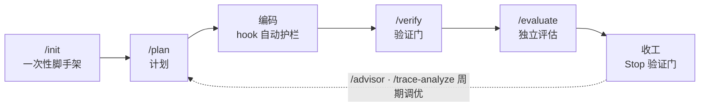

<div align="center">

# Harness Kit

**为 [Claude Code](https://claude.com/claude-code) 打造的项目无关 *harness engineering* 插件**

把计划门禁、完成前验证、循环检测与「生成 / 评估分离」，自动织入你的 AI 编码流程。

[](https://claude.com/claude-code)
[](./.claude-plugin/plugin.json)
[](https://github.com/whieet/harness-kit/actions/workflows/test.yml)
[](./LICENSE)

[English](./README.en.md) · **简体中文**

</div>

---

## 这是什么

Harness Kit 是一个 **Claude Code 插件**（专为 Claude Code 设计，**不是 codex 等其它 CLI**）。它借助 Claude Code 的 hooks / 斜杠命令 / 子代理 / 技能机制，在 AI 编码的关键节点自动加上「护栏」：动手前要有计划、收工前必须过验证门、反复改同一文件会预警、最终质量由一个独立的评估子代理打分。

所有与具体项目相关的东西（验证命令、分层规则、计划目录、文档路径、指标……）都集中在每个项目自己的 `.harness/config.json` 里——插件代码本身**项目无关**，因此同一套 harness 能套用到 Godot、Web 或任意自定义技术栈。

## 什么是 harness engineering

*Harness*（挽具）指**模型之外的一切**——系统提示、工具、上下文管理、控制流、反馈循环与记忆。**Harness engineering** 不去改模型本身，而是工程化模型周围的这套「脚手架」，把参差不齐的模型能力，塑形成可靠、能长跑的 agent。

**设计哲学**（综合 OpenAI / Anthropic / LangChain 的公开实践）：

- **杠杆在 harness，不在模型** —— 模型权重你改不了，但它周围的脚手架可以；架构选择与模型选择同等重要。
- **计划 / 生成 / 评估分离** —— 别让同一个 agent 既干活又给自己打分；自评不可靠，要用独立评估者 + 具体可度量的标准。
- **自我验证循环** —— 显式 plan → build → test → fix，逼模型真去跑测试、验证，而不是停在「看起来对」。
- **增量而非一把梭** —— 长任务里 agent 爱「一次做完」并过早宣布完成；harness 强制小步推进、端到端验证。
- **跨上下文的连续性** —— 上下文会被填满 / 压缩而「失忆」；用进度文件、记忆与干净交接（git 提交、状态快照）跨多个上下文窗口续上状态。
- **检测坏模式 + 推理预算** —— 用循环检测、完成前检查清单拦住「打转」；把高推理预算优先花在计划与验证这两个收益最大的环节。

> harness 里的假设会随模型变强而过时——新模型能原生处理的就该精简掉。Harness Kit 正是把上述哲学，落成 Claude Code 里可直接用、可逐项开关的护栏（见 [核心纪律](#核心纪律)）。

## 为什么需要它

AI 编码常见的几个失控点，正是 Harness Kit 要拦住的：

- **未经计划就动手** —— 大改动缺少 Definition of Done，越改越偏。
- **漏验证就收工** —— 没跑 lint / 构建 / 测试就宣布「完成」。
- **自评偏差** —— 让生成者给自己打分，结论不可靠。
- **上下文丢失** —— 长会话被压缩后，计划与进度凭空蒸发。
- **文档与代码漂移** —— 文档逐渐与实现脱节、链接失效。

## 核心纪律

| 纪律 | 作用 |
| --- | --- |
| 计划门禁 · *Plan-gating* | 编辑受管代码前需有覆盖它的计划，否则自动补一份计划骨架 |
| 完成前验证门 · *Verification gate* | Stop 时自动跑 `harness-verify` 配置的门；strict 模式下不过则拦截收工 |
| 循环检测 · *Loop detection* | 单文件在一次会话内反复编辑超阈值（默认 5）即预警，防止打转 |
| 生成-评估分离 · *Gen · Eval* | 派出无编辑权限的 `evaluator` 子代理按 rubric 独立打分，杜绝自评 |
| 上下文存活 · *Context survival* | 压缩前快照计划 / 进度，压缩后再注入，长会话不丢状态 |
| 架构分层 · *Layering* | 按可配置的依赖方向规则检查跨层非法引用 |
| 文档一致性 · *Doc coherence* | 校验计划状态、命名、占位内容、死链与架构漂移 |
| 努力分级 · *Effort routing* | 低/中强度回合只跑 fast 档门（可选，默认关，绝不悄悄削弱验证）|
| 能力开关 · *Capability toggles* | 每项 harness 行为都能在配置里单独开关，由你掌控 |

## 快速上手

> 前置：[Claude Code](https://claude.com/claude-code)。Harness Kit 是 Claude Code 插件，安装后默认启用。

**1) 安装插件**（在 Claude Code 中输入）

```text
/plugin marketplace add whieet/harness-kit
/plugin install harness-kit@harness-kit
```

**2) 在你的项目里初始化**

```text
/harness-kit:init
```

选择项目类型（`godot` / `web` / `custom`），它会脚手架生成 `.harness/config.json` + `rubric.md` + 计划目录，并启用 git pre-commit 门；若项目尚无 `CLAUDE.md`，再生成一份 ToC 式工程章程（铁律 / 工作流 / 仓库地图 / 验证 SOP），随后做一次 harness 范围的 codebase 分析填掉占位并校准配置。已有 `CLAUDE.md` 则绝不触碰（连 `--force` 也不会）。中文章程传 `--lang zh`，不要章程传 `--no-claude-md`。幂等；想重置配置传 `reset`。

**3) 正常开发** —— PreToolUse / PostToolUse 等 hook 自动护栏（计划门、循环检测、追踪），你无需手动触发。

**4) 收工** —— Stop hook 自动跑验证门；strict 模式下不过则挡住「完成」。

## 斜杠命令

| 命令 | 作用 |
| --- | --- |
| `/harness-kit:init` | 初始化：识别 / 询问项目类型，脚手架配置 + rubric + 计划骨架 +（缺则建的）ToC 式 CLAUDE.md 章程，启用 pre-commit 门，并分析 codebase 填占位、校准配置 |
| `/harness-kit:plan` | 启动 Plan→Build→Verify→Done 工作流；批准后由 hook 把计划落盘到计划目录 |
| `/harness-kit:verify` | 手动运行验证门编排器，逐门报告通过 / 失败（Stop 门的手动版）|
| `/harness-kit:advisor` | 展示当前成熟度阶段、背后的工件指标，以及已解锁的 harness 能力 |
| `/harness-kit:evaluate` | 派出 skeptical `evaluator` 子代理，按 rubric 独立给当前改动打分 |
| `/harness-kit:trace-analyze` | 分析会话 trace 的失败模式（通过率、会话失衡、高频改动文件），建议如何调优 |

## 平时怎么用



初始化一次之后，平时的一次任务大致这样走（〔自动〕＝hook 自动发生，〔手动〕＝你输入命令）：

1. **会话开始** 〔自动〕—— SessionStart 注入交接：git 状态、进行中的计划、advisor 仪表盘、关键文档，Claude 一上来就接上「上次到哪了」。
2. **规划** 〔手动·非平凡改动〕—— `/harness-kit:plan` 进入计划模式；你批准后 hook 自动把计划落盘并开始追踪 DoD。小改动可跳过。
3. **编码** 〔自动护栏〕—— 每次编辑前检查该文件是否被计划覆盖（缺则补骨架）；编辑后累计循环计数，同一文件改太多次会预警；工具调用写入 trace。
4. **随手自查** 〔手动·可选〕—— `/harness-kit:verify` 看验证门，`/harness-kit:advisor` 看阶段与能力。
5. **收工验证** 〔自动·可拦截〕—— Stop 跑验证门＋未提交检查＋计划 DoD 自检；strict 模式不过会挡住「完成」，提示继续修。
6. **独立评估** 〔手动·可选〕—— 宣布完成前 `/harness-kit:evaluate`，派无编辑权限的 `evaluator` 按 rubric 打分，避免自评。
7. **上下文不丢** 〔自动〕—— 长会话被压缩时快照计划/进度，压缩后的下一条消息再注入，状态延续。
8. **周期调优** 〔手动·偶尔〕—— `/harness-kit:trace-analyze` 看失败模式，据此微调 `.harness/config.json`。

> 多数环节（1 / 3 / 5 / 7）全自动，你几乎不用操心；真正需要你出手的只有 `plan` / `verify` / `evaluate` / `advisor` 这几个命令。

## 配置概览

一切项目相关配置都在 `.harness/config.json`（随项目入库）。**你通常不必手写它——直接用自然语言让 Claude Code 改**（「加一个 `npm test` 门」「关掉循环检测」「禁止 UI 层直连数据库」），它会照着面向 AI 的 [配置指南](./docs/configuration.md) 编辑。关键段：

| 配置段 | 含义 |
| --- | --- |
| `gates[]` | 有序的验证门，由 `harness-verify` 执行（取代写死的校验步骤）|
| `verifyCmd` / `buildCmd` / `testCmd` | 验证 / 构建 / 测试入口命令 |
| `layeringRules[]` | 依赖方向约束（作用域 glob + 禁止正则 + 修复提示）|
| `plan` | 计划生命周期：目录、哪些代码改动需要计划（`codeGlob`）、状态字段、模板 |
| `docs` | 关键文档、扫描根、架构路径、过期阈值、占位 / 漂移检测 |
| `metrics[]` | 工件计数（按 glob），advisor 仪表盘的输入 |
| `enabledCapabilities` | 各 harness 行为开关：`planGate` / `loopDetection` / `toolTrace` / `evaluator` / `contextSnapshot` 等 |
| `effortRouting` | 努力分级（Reasoning Sandwich）开关 |
| `evaluator` / `verificationRecipe` | 生成 / 评估分离；把每个 rubric 维度映射到验证命令或 MCP 工具 |

完整字段、带注释示例与「用户说→怎么改」配方见 [**配置指南**](./docs/configuration.md)（写给 AI，也方便人查）；机器可读 schema 见 [`templates/config.schema.json`](./templates/config.schema.json)。

## 项目预设

`/harness-kit:init` 提供三种脚手架（见 [`templates/`](./templates)）：

- **godot** —— Godot 游戏：headless 编译门、分层规则，含玩法 / 视觉 / 集成 / 质量维度的 rubric。
- **web** —— React / Vue / Vite / Next / Svelte：npm lint / test / build 门，含 UX / 集成 / 质量维度的 rubric。
- **custom** —— 自定义技术栈，无预设，按需填写 `.harness/config.json`。

三种预设共享一份双语 CLAUDE.md 章程模板（[`claude-md-template.en.md`](./templates/claude-md-template.en.md) / [`claude-md-template.zh.md`](./templates/claude-md-template.zh.md)），内容为通用 harness engineering 纪律，项目事实由 init 后的 codebase 分析填入。

## 环境要求

- **Claude Code** —— 本工具是 Claude Code 插件，依赖其 hooks / 斜杠命令 / 子代理运行时；**不适用于 codex 等其它 CLI**。
- **Python 3.9+** —— 核心逻辑为 Python，`bin/` 下为薄壳启动器。
- **平台** —— macOS / Linux / Windows（Windows 走 Git Bash）。

## 测试与质量保障

四层测试金字塔：单元/奇偶（L1）→ 结构 + 全会话回放 e2e（L2，均不调模型）→ **真实无头 Claude** 场景套件（L3，每条纪律一个实弹场景）→ 按 [参考来源](#参考来源) 提炼的 17 条原则做 **3 评委 AI 符合性审计**（L4）。

```bash
python3 -m pytest tests              # L1+L2，免费，CI 在 push main / PR 时全平台跑
claude plugin validate . --strict    # manifest 严格校验，免费
bash scripts/dev-e2e.sh full         # L3+L4：6 场景 + 3 评委审计（真实 Claude）
```

详见 [测试指南](./docs/testing.md)；与 man-in-the-mirror 两个月实践蓝本的诚实对照见 [蓝本对照](./docs/benchmark.md)。

## 参考来源

Harness Kit 的思路综合并致敬以下公开实践（也是本仓库 harness engineering 的「记忆来源」）：

- **OpenAI** —— [Harness Engineering](https://openai.com/zh-Hans-CN/index/harness-engineering/)
- **Anthropic** —— [Harness design for long-running application development](https://www.anthropic.com/engineering/harness-design-long-running-apps)
- **Anthropic** —— [Effective harnesses for long-running agents](https://www.anthropic.com/engineering/effective-harnesses-for-long-running-agents)
- **LangChain** —— [The anatomy of an agent harness](https://www.langchain.com/blog/the-anatomy-of-an-agent-harness)
- **LangChain** —— [Improving deep agents with harness engineering](https://www.langchain.com/blog/improving-deep-agents-with-harness-engineering)

## 许可证

[MIT](./LICENSE) © River
